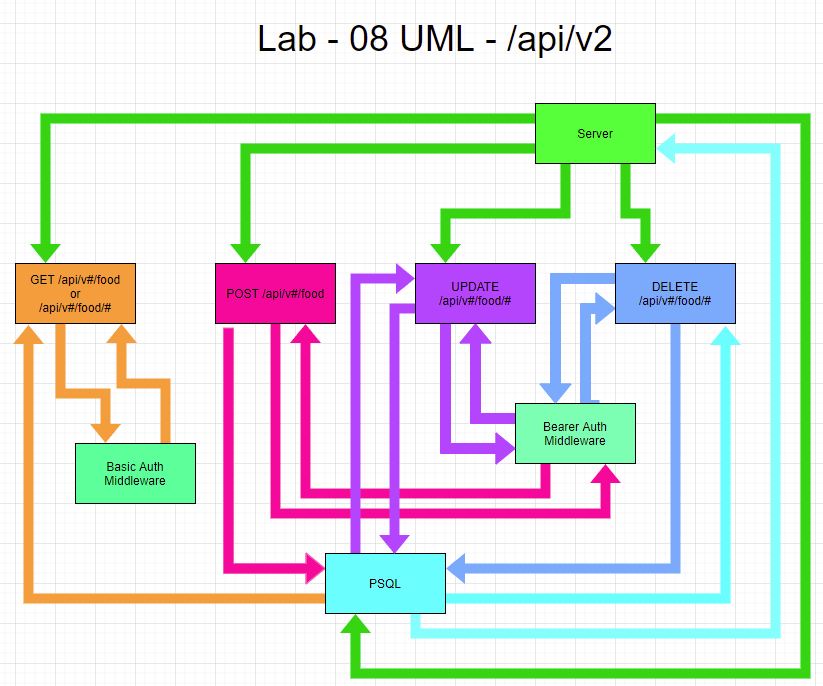

# Auth-Api

## Auth

Auth is hashing out password along with our username that creates a hashed password and username.

## Technology Used

`"base-64": "^1.0.0"`  
`"bcrypt": "^5.0.0"`  
`"cors": "^2.8.5"`  
`"dotenv": "^8.2.0"`  
`"express": "^4.17.1"`  
`"jest": "^26.6.3"`  
`"morgan": "^1.10.0"`  
`"pg": "^8.6.0"`  
`"sequelize": "^6.6.2"`  
`"sequelize-cli": "^6.2.0"`  
`"sqlite3": "^5.0.2"`  
`"supertest": "^6.1.3"`  

## CRUD / REST

POST route for `/register`

```
Accepts JSON or FORM Data with the keys "username" and "password"
Uses postgres to create your new record
Returns a 201 for your created user record
```

POST route for `/signin`

```
Using middleware, we authicate your information with encoding to log in
When validated, sends JSON user record
```

GET route for `/users`

```
Using middleware, we authicate your encryption to display the users that have registered
```

POST route for `/secret`

```
Using middleware, we authicate your information to view specialized secret documents
```

## Restful API

We have two versions.

- `/api/v1/food` is REST without middleware auth
  - This is our test routes. To make sure everything works as we want.
- `/api/v2/food` is REST with middleware auth
  - Here we have roles set, the level of role will depend on how many things you can complete with a RESTful API.


Get route for `/get` `/api/v#/food`

```
Using REST we grab all our data, if you add "/api/v#/food/#", you can view a specific entry 
```

Post route for `/post` `/api/v#/food`

```
Using REST we can post data into our server. Models using "name", "filling", and "frosting"
```

Update route for `/put` `/api/v#/food/#`

```
Using REST we can update data into our server depending on the specific entry. Models using "name", "filling", and "frosting" to update the entry
```

Delete route for `/delete` `/api/v#/food/#`

```
Using REST we can delete data into our server depending on the specific entry.
```

## Whiteboard UML



## Routes

```
/register

/signin

/users

/secret

/api/v1/food

/api/v1/food
```

## Install

```
npm i
```

## Usage

```
npm run dev
```

## Deployment

[Heroku Deployment](https://auth-api-401n19.herokuapp.com/)

## Collaboration

- Ayrat Govin
- Heather Bisgard
